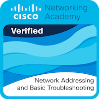
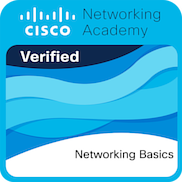
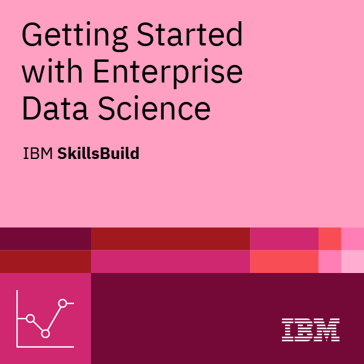
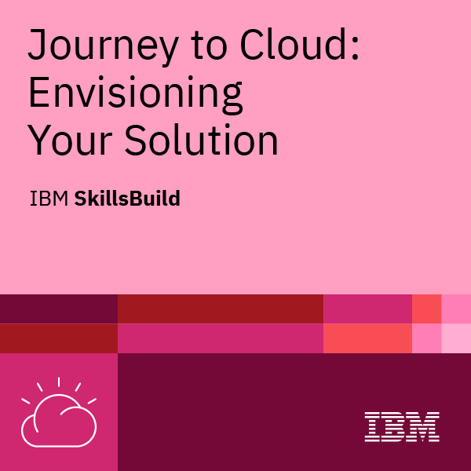

  

  <h1 align="center">Hey there, I'm Kunal 👋</h1>

---

## 👨‍💻 About Me
- 🎓 **B.Tech in Computer Science | Thapar University (2024 Graduate)**  
- 💻 **Aspiring Software Engineer, Full-Stack Developer & Quant Developer**  
- 🚀 Passionate about **building scalable systems, AI-powered tools, trading systems & quantitative models**  
- 🌱 Currently exploring **Generative AI, RAG Systems, Algorithmic Trading, and Cloud (AWS)**  
- ⚡ Fun Fact: _I break things just to build them back better._  

---

## 🛠️ Tech Stack & Domains

<table align="center" style="width:100%">
  <tr>
    <th>Languages</th>
    <td>
      
      
      
    </td>
  </tr>
  <tr>
    <th>Frameworks / Libraries</th>
    <td>
      
      
      
      
    </td>
  </tr>
  <tr>
    <th>Databases & Data</th>
    <td>
      
      
      
    </td>
  </tr>
  <tr>
    <th>Tools, Deployment & Cloud</th>
    <td>
      
      
      
    </td>
  </tr>
  <tr>
    <th>Quant / Trading</th>
    <td>
      
      
      
    </td>
  </tr>
</table>

---

## 📌 Featured Projects  

<table align="center" style="width:100%">
  <tr>
    <td>
      
    </td>
    <td>
      
    </td>
  </tr>
  <tr>
    <td>
      
    </td>
    <td>
      <!-- Optionally, you may add a quant / trading project here -->
    </td>
  </tr>
</table>

---

## 🏆 Achievements
- 🏅 **Flipkart GRID Semi-Finalist 2023**  
- 🏅 **Ramanujan Medalist**  
- 🏅 **CodeKaze Competitive Ranker**  

---

## 🏅 Certifications

  
  
  
  
  

---

## 🎟️ Holopin Badges

---

## 📊 GitHub Stats

  
  

---

## 📫 Connect with Me

  
  

---

  ⭐️ <i>“Code, Learn, Build, Repeat.”</i>  

</samp>
